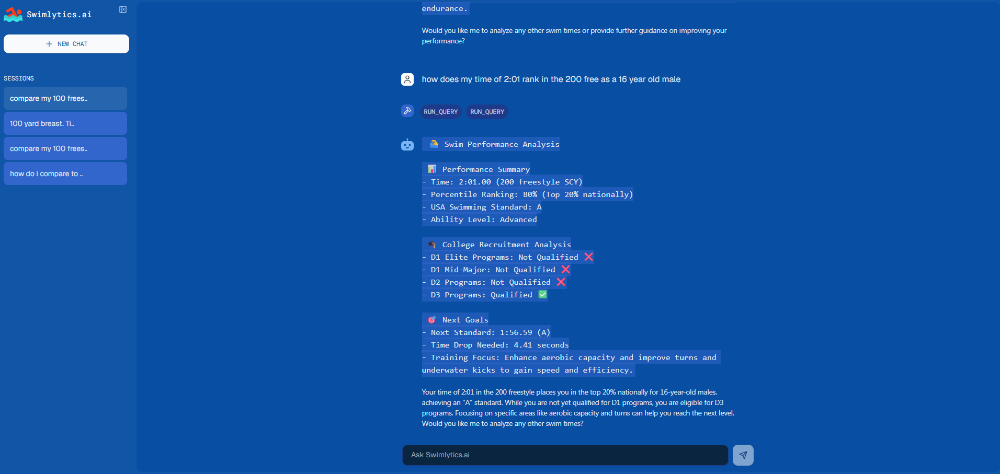

# Swimlytics.ai UI
👉 [Live App](https://ai-agent-ui-w35p.onrender.com)

A modern chat interface for Swimlytics.ai agent built with Next.js, Tailwind CSS, and TypeScript. 


## ✨ Features

- 💬 **Modern Chat Interface**: Clean design with real-time streaming support
- 🧩 **Tool Calls Support**: Visualizes agent tool calls and their results
- 🧠 **Reasoning Steps**: Displays agent reasoning process (when available)
- 📚 **References Support**: Show sources used by the agent
- 🖼️ **Multi-modality Support**: Handles various content types including images, video, and audio
- 🎨 **Customizable UI**: Built with Tailwind CSS for easy styling
- 🧰 **Built with Modern Stack**: Next.js, TypeScript, shadcn/ui, Framer Motion, and more

## 🚀 Getting Started

### Installation

1. Clone the repository:

```bash
git clone https://github.com/dlnracke/agent-ui.git
cd agent-ui
```

2. Install dependencies:

```bash
npm install
```

3. Environment Variables
Create a `.env` file for your Swimlytics.ai endpoint:

```
NEXT_PUBLIC_APP_API_URL=http://localhost:8000
```
3. Start the development server:

```bash
npm run dev
```

4. Open [http://localhost:3000](http://localhost:3000) with your browser to see the result.

## Connecting to an Swimlytics.ai

By default Swimlytics.ai UI connects to `http://localhost:8000`. You can easily change this by editing .env.

## License

This project is licensed under the [MIT License](./LICENSE).
